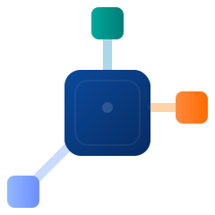

# AMWK - AntMind WebKit Framework

<div align="center"></div>

AMWK is a lightweight, modular web framework designed for simplifying web application development in Go. It provides a highly flexible core with pluggable adapters for different runtimes (net/http, AWS Lambda, etc.).

> [!IMPORTANT]
> This repository is in early development. The core design and APIs are still evolving, and breaking changes may occur. We welcome feedback and contributions to help improve the framework.

## Why this design

- Context-first: most common operations (params, binding, response rendering, control flow, shared values) are exposed on `core.Context`, so users rarely need to use raw `*http.Request` or low-level response objects.
- Small, stable core: the `core` package exposes only abstract interfaces (Context, Request, Response, Application, HandlerFunc, Logger). Implementations live in `engine`, `web`, `lambda`, etc.
- Pluggable adapters: same middleware and handlers can run on `net/http` or AWS Lambda with minimal changes because adapters translate platform requests/responses to the core interfaces.
- Middleware-first: full support for global, group, and request-local middleware (the framework supports `ctx.Use(...)` to append middleware only for the current request).

---

## Framework Modules

- [`core`](https://github.com/go-amwk/core): The core module defines the fundamental interfaces and types for the framework. It provides the basic building blocks for handling requests and responses in a platform-agnostic way.
- [`engine`](https://github.com/go-amwk/engine): The engine module implements an adapter-agnostic request handling engine. It provides the main request processing loop, middleware chaining, and more.
- [`web`](https://github.com/go-amwk/web): An HTTP adapter that based on Go's `net/http` package.
- [`examples`](https://github.com/go-amwk/examples): A collection of runnable examples demonstrating various features and use cases of the framework.

---

## Getting Started

> The AMWK framework requires Go 1.22 or later.

Install an adapter (e.g. `web`) and its dependencies:

```bash
go get github.com/go-amwk/web
go mod tidy
```

Create a simple application by the `web` HTTP adapter to render "Hello, World!" for all requests:

```go
package main

import (
  "github.com/go-amwk/core"
  "github.com/go-amwk/web"
)

func main() {
  app := web.Default()

  app.Use(func(ctx core.Context) error {
    ctx.Write([]byte("hello world"))
    return nil
  })

  app.Start()
}
```

---

## Examples

We provide a set of runnable examples in the [`examples`](https://github.com/go-amwk/examples) repo to demonstrate various features and use cases of the framework.

- [`examples/hello-world`](https://github.com/go-amwk/examples/tree/main/hello-world): A minimal example showing how to create a simple "Hello, World!" application using the framework and the `web` adapter.
- [`examples/query-params`](https://github.com/go-amwk/examples/tree/main/query-params): An example demonstrating how to handle query parameters in requests and use them in responses.
- ...

Each example folder should include a README explaining how to run, test, and extend the example.

---

## Contributing

We welcome contributions. Suggested process:
1. Open an Issue to discuss large API or core changes (especially any `core` interface changes).
2. Fork -> feature branch -> PR:
   - Run `go test ./...` and lints (`golangci-lint`) locally.
   - Include tests for new functionality.
   - Keep PRs small and focused.
3. API stability:
   - `core` is a stable contract. Breaking changes should target a new major version and be discussed in an issue first.
4. Tests & CI:
   - Provide unit tests and integration tests for adaptors and engine behavior.
   - Update `examples` or add new examples when adding features.
5. CLA / licensing:
   - By contributing, you agree to the repository license (see `LICENSE`).

See `CONTRIBUTING.md` in the repository root for templates and more details.

---

## License

This project uses the MIT License. See `LICENSE` in the repository root.
